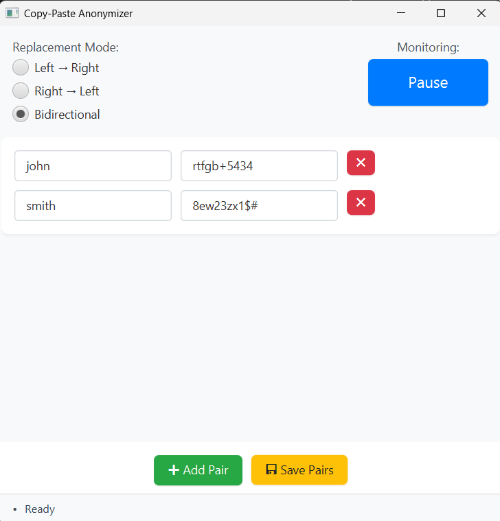

# Copy-Paste Anonymizer

A JavaFX desktop application that automatically monitors your clipboard and replaces sensitive information with anonymized alternatives in real-time.

## Features

- **Real-time Clipboard Monitoring**: Automatically detects when you copy text to clipboard
- **Flexible Replacement Modes**:
    - Left → Right: Replace original text with anonymized version
    - Right → Left: Replace anonymized text with original version
    - Bidirectional: Automatically detect and replace in both directions
- **User-friendly Interface**: Simple GUI to manage text replacement pairs
- **Persistent Storage**: Saves your replacement pairs to `pairs.txt` file
- **Visual Feedback**: Toast notifications and status indicators
- **Pause/Resume**: Toggle clipboard monitoring on demand

## Requirements

- Java 21 or higher
- JavaFX 21
- Windows

## Download

So far the application was only tested on Windows 10/11.
- [Latest Release for Windows 10/11](https://github.com/krzysztofplociennik/copy-paste-anonymizer/releases/latest)

## Usage

1. **Launch the Application**: 
    - If downloaded - just go to 'cpa/bin/' and open the 'copy paste anonymizer' (Windows Batch File)
    - If cloned from GitHub - run the application using Gradle:
```
./gradlew run
```
2. **Add Replacement Pairs**: Click "➕ Add Pair" to create new text replacement rules
3. **Configure Pairs**: Enter the original text and its replacement in the text fields
4. **Select Mode**: Choose your preferred replacement mode:
    - **Left → Right**: Only replace original → anonymized
    - **Right → Left**: Only replace anonymized → original
    - **Bidirectional**: Smart detection and replacement in both directions
5. **Save Configuration**: Click "💾 Save Pairs" to persist your settings
6. **Monitor Clipboard**: The app automatically monitors clipboard - copy any text and watch it get anonymized!



### Example Use Case

**Replacement Pair:**
- Original: `john.doe@company.com`
- Replacement: `user1@example.com`

**Bidirectional Mode:**
- Copy `john.doe@company.com` → Clipboard becomes `user1@example.com`
- Copy `user1@example.com` → Clipboard becomes `john.doe@company.com`

## Configuration

The application stores replacement pairs in a `pairs.txt` file in the working directory. The format is:
```
original_text = replacement_text
another_original = another_replacement
```

## Technical Details

### Dependencies
- JavaFX Controls & FXML
- ControlsFX
- JNA 
- Lombok 
